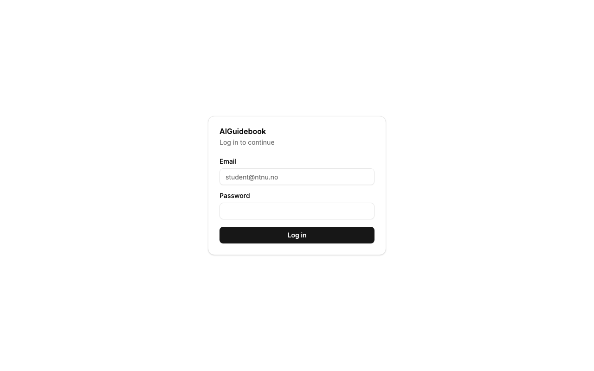
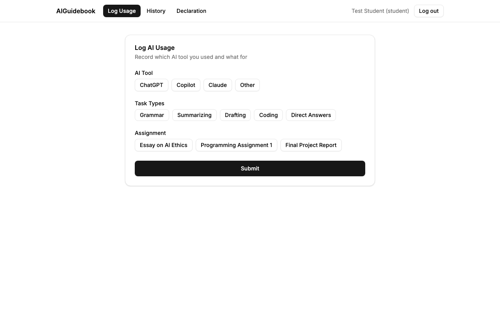
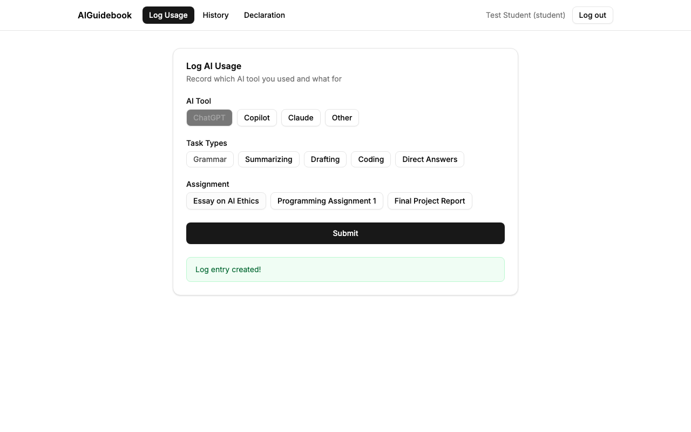
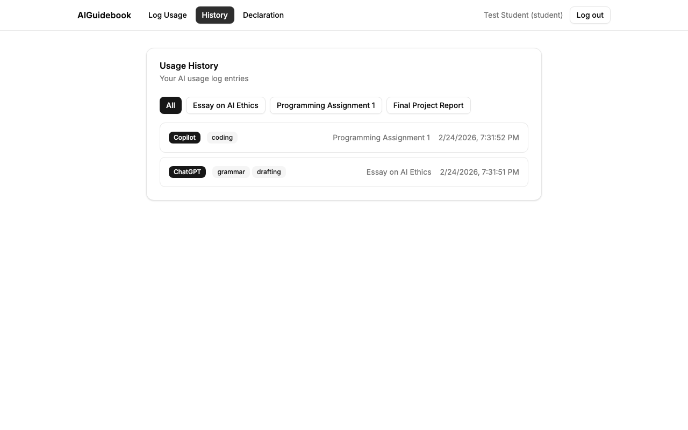
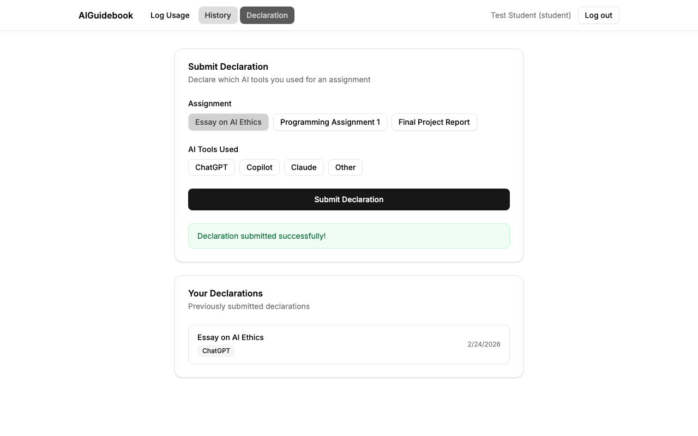
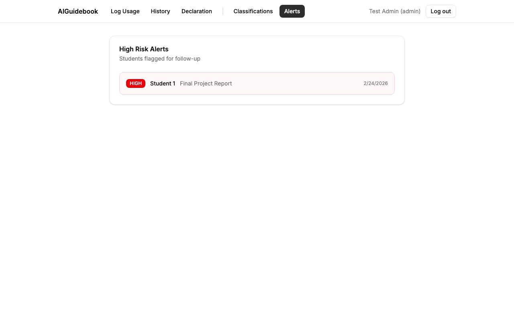

# Task 2.2 - Code Generation

## Description

Use ChatGPT, Claude, GitHub Copilot, or similar AI tools to generate a full-stack web application that implements the requirements selected from Exercise 2.1. Following your defined prompting strategy and requirement set, you will guide an AI code assistant to generate the initial version of the system.

Your objective is to deliver:

- Correct installation and configuration of all required libraries and dependencies
- Revision of AI-generated code if needed
- A working full stack web application that runs locally in your computer
- A clear and complete explanation of the codebase structure and design decisions

## Expected Outcome

A document including:

- Link to a public GitHub repository containing the full project
- Screenshots demonstrating successful execution
- Explanation of the role of each major component
- What code was generated by AI and what was written or modified by you

## Evaluation Criteria

- **Successful Code Execution:** The code must run without errors in your local environment and meet the functional scope agreed.
- **Quality of reflection:** Students must clearly explain architecture, component purpose, state management choices, and division between AI-produced and student-written code.

## Our Submission

### Repository

[github.com/ryanravn/tdt4242-ntnu-group-17-assignment](https://github.com/ryanravn/tdt4242-ntnu-group-17-assignment)

### Screenshots

### Codebase Structure and Component Roles

The application is a single-project full-stack web app. Hono serves the REST API and, in production, the built SolidJS frontend from one process. The project is split into four top-level directories.

#### Backend (`server/`)

| File | Role |
|------|------|
| `server/index.ts` | Application entry point. Creates an `OpenAPIHono` instance, registers CORS, the JSON error handler, all route modules, the OpenAPI spec endpoint (`/openapi`), Scalar API docs (`/docs`), and a health check. In production it serves the built frontend as static files; in development it redirects to the Vite dev server. |
| `server/routes/auth.ts` | Authentication routes (`POST /login`, `GET /me`). Login verifies hashed passwords with `Bun.password.verify`, issues a JWT, and returns the user. `/me` validates the JWT and returns the current user. |
| `server/routes/logs.ts` | Logging routes (RE-09, RE-10, RE-12). `POST /` creates a log entry after validating the assignment exists (RE-10). `GET /` returns the student's logs ordered by most-recent-first, with optional `assignment_id`, `from`, and `to` query filters. |
| `server/routes/declarations.ts` | Declaration route (RE-11) and the risk classification engine (RE-13, RE-14, RE-15, RE-16). `POST /` inserts the declaration (returning 409 if one already exists for the same student+assignment), then calls `classifyDeclaration()`. That function fetches all logs for the student+assignment, compares logged tools against declared tools (RE-14), determines risk level (RE-13), inserts a classification record, and creates an alert if the risk is high (RE-16). `GET /` returns the student's own declarations. |
| `server/routes/classifications.ts` | Read-only admin endpoint. `GET /` returns all stored risk classifications with risk level, discrepancy details, and timestamps. |
| `server/routes/alerts.ts` | Read-only admin endpoint. `GET /` returns all high-risk alert records. |
| `server/lib/auth.ts` | JWT helper functions: `createToken` signs a payload with HS256, `requireAuth` extracts and verifies the Bearer token from the Authorization header. |
| `server/db/schema.ts` | Drizzle ORM schema defining all tables (`users`, `assignments`, `logs`, `declarations`, `classifications`, `alerts`) and enums (`role`, `tool`, `task_type`, `risk_level`). Foreign keys enforce referential integrity. The declarations table has a composite unique constraint on `(studentId, assignmentId)`. |
| `server/db/client.ts` | Creates the Drizzle client from `DATABASE_URL` using `postgres` and exports `db`. |
| `server/db/seed.ts` | Seeds two users (student and admin with hashed passwords) and three assignments. Uses `onConflictDoNothing()` for idempotency. |

#### Frontend (`client/`)

| File | Role |
|------|------|
| `client/index.tsx` | SolidJS entry point. Renders `<App />` into the DOM. |
| `client/App.tsx` | Root component. Manages authentication state (login form, session restore, dev auto-login with seed user). After login, renders a navigation bar (role-aware: students see Log Usage, History, Declaration; admins also see Classifications and Alerts) and a `<Switch>` that mounts the active page component based on a signal. |
| `client/lib/api.ts` | Thin fetch wrapper. `apiFetch<T>()` attaches the JWT from localStorage to every request and throws on non-OK responses. The `api` object exposes typed methods (`createLog`, `getLogs`, `createDeclaration`, `getDeclarations`, `getClassifications`, `getAlerts`) so pages don't deal with raw fetch. |
| `client/lib/utils.ts` | `cn()` utility - merges Tailwind classes using `clsx` + `tailwind-merge`. Used by all components. |
| `client/pages/LogUsage.tsx` | Log AI Usage form (RE-09). Lets the student pick an AI tool, toggle one or more task types, select an assignment, and submit. Calls `api.createLog()`. |
| `client/pages/UsageHistory.tsx` | Usage History view (RE-12). Fetches logs on mount via `api.getLogs()`, displays them in a list with assignment-filter buttons. |
| `client/pages/SubmitDeclaration.tsx` | Declaration form (RE-11). Select an assignment and toggle which tools were used, then submit. Shows existing declarations below the form (fetched via `api.getDeclarations()`). Displays 409 errors as "Declaration already exists". |
| `client/pages/Classifications.tsx` | Admin classifications view (RE-15). Fetches all classifications on mount, displays risk level as a colored badge, and lists any undeclared or declared-not-logged tool discrepancies. |
| `client/pages/Alerts.tsx` | Admin alerts view (RE-16). Fetches all alerts on mount, displays each with a destructive badge, student/assignment info, and timestamp. |
| `client/components/*` | Reusable UI primitives (Button, Input, Label, Card, Badge, Sonner toast) built with Kobalte for accessibility, CVA for variant management, and Tailwind for styling. Follows the same shadcn-style pattern used in our reference project. |
| `client/index.css` | Tailwind 4 theme with OKLCH color variables, Inter font, light/dark mode support, and base styles. |

#### Tests (`tests/`)

| File | Covers |
|------|--------|
| `tests/health.test.ts` | Health check and OpenAPI spec endpoints |
| `tests/auth.test.ts` | Login (valid, wrong password, non-existent user, missing fields) and /me (authenticated, no token, invalid token) |
| `tests/logs.test.ts` | RE-09 (log creation, validation errors, auth) and RE-10 (assignment validation, 404 for bad ID) |
| `tests/logs-read.test.ts` | RE-12 (list logs, ordering, assignment_id filter, date range filter, empty array, auth) |
| `tests/declarations.test.ts` | RE-11 (create declaration, 409 conflict, validation, auth, auto-triggers classification) |
| `tests/risk.test.ts` | RE-13 (low/medium/high classification), RE-14 (undeclared tools, declared-not-logged, no discrepancies), RE-15 (GET /api/classifications), RE-16 (alert on high risk, no alert on low/medium, GET /api/alerts) |

All 38 tests use `app.request()` directly against the Hono app - no HTTP server, no generated client. Each test file cleans its data with `beforeAll` to ensure isolation.

#### Configuration and Tooling

| File | Role |
|------|------|
| `vite.config.ts` | Configures SolidJS and Tailwind plugins, the `@` path alias to `client/`, proxies `/api`, `/openapi`, and `/docs` to localhost:3000 in development, and builds to `dist/client`. |
| `drizzle.config.ts` | Points Drizzle Kit at the schema file and PostgreSQL connection for migrations. |
| `scripts/generate-api-types.ts` | Imports the Hono app in-process, fetches the `/openapi` spec, and pipes it through `openapi-typescript` to generate `client/lib/api-types.d.ts`. |
| `scripts/watch-api-types.ts` | Polls the OpenAPI spec during development and regenerates types when the schema changes. |
| `eslint.config.js` | ESLint with TypeScript plugin. No Prettier - linting only. |
| `docker-compose.yml` | PostgreSQL 17 container on port 5432. Works with both Docker and Podman. |
| `CLAUDE.md` | AI instruction file linking key documents, describing the stack, TDD workflow, development order, project layout, commands, and conventions. Continuously updated as conventions emerged. |

### AI-Generated vs. Human-Written Code

**All application code was generated by AI** (Claude, via Claude Code CLI). This includes:

- All backend route handlers, database schema, seed data, and auth logic
- All frontend pages, components, CSS theme, and API client
- All 38 test files
- Configuration files (Vite, Drizzle, ESLint, Docker Compose, type generation scripts)

**Human contributions were limited to:**

- Technology stack selection and architecture decisions (`decisions.md`)
- Prompting strategy and phasing (`tasks/2.1-prompting-strategy.md`)
- The AI instruction file (`CLAUDE.md`) - initial structure and ongoing refinements
- Requirements revision (`REQUIREMENTS.md`) - rewriting abstract requirements into concrete, testable acceptance criteria with specific API endpoints and HTTP status codes
- Reviewing AI output and providing corrective feedback (e.g. "use Bun not Node", "no monorepo", "use Podman", "auto-login in dev")

No application code (TypeScript, TSX, CSS) was manually written or edited by a human. All code changes went through the AI, guided by human review and iterative feedback as described in the prompting strategy.

## Feedback

*Not yet graded.*
