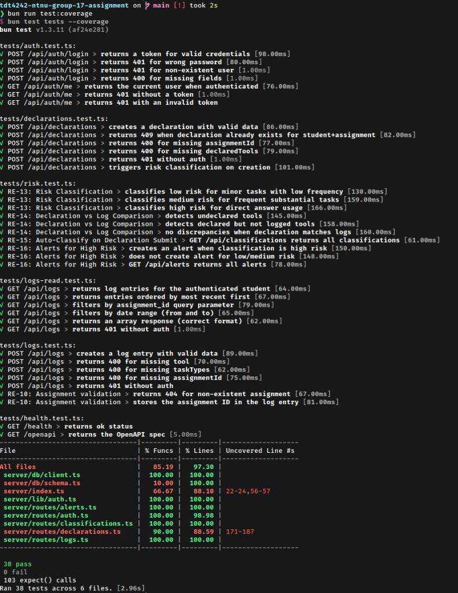
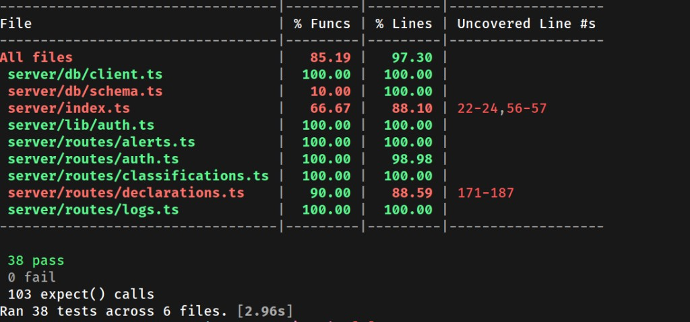
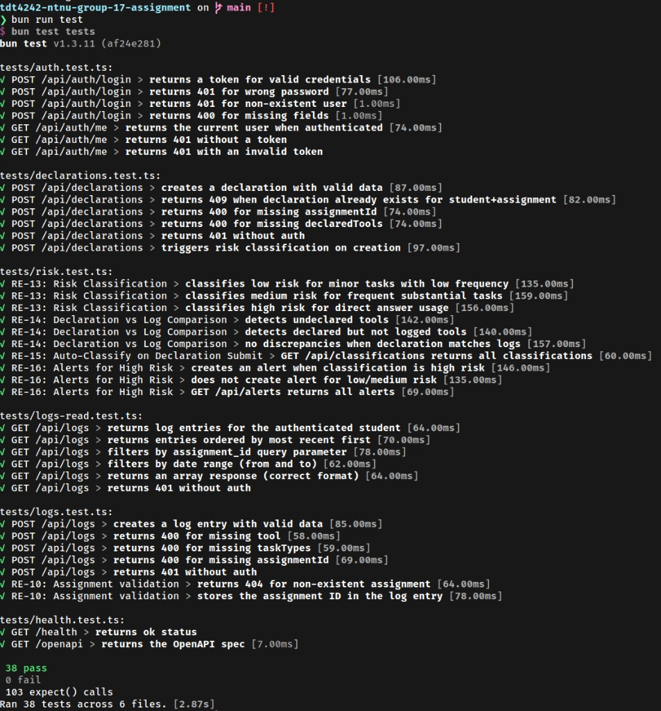

# Task 3.2 - Unit Test Execution

## Description

In this task, you will move from test design to test implementation. Using your existing codebase, you will implement executable unit tests, with optional assistance from AI-based development tools.

The objective is to achieve high structural test coverage, specifically:

- **Line coverage:** >= 60%
- **Branch coverage:** >= 70%
- **Function/method coverage:** >= 80%

You must write or generate real, runnable unit tests that target critical functions and logic in the system. The test suite must execute locally without errors, produce reproducible coverage results, and demonstrate meaningful testing of edge cases and branch conditions.

## Expected Outcome

1. **Executable test files** committed to your GitHub repository.
   - Tests stored under `/tests/` or `/src/tests/`
   - Tests must include assertions, setup/teardown where relevant, mocks or stubs, edge-case coverage, and explicit branch testing

2. **Coverage report**, generated by running: `bun run test:coverage`
   - Include: Screenshot(s) of the terminal coverage report
   - Visible line, branch, and function statistics

## Evaluation Criteria

- **Achievement of coverage targets:** Test suites meet or exceed the specified line, branch, and function coverage thresholds.
- **Quality of unit tests:** Tests are deterministic, maintainable, clearly structured, and focused on behaviour rather than implementation details.

---

## Test suite overview

All executable tests live in **`tests/`** and run with `bun test tests` (or `bun run test`). Coverage is generated via `bun run test:coverage` (`bun test tests --coverage`).

| File | Focus | TC IDs |
|------|-------|--------|
| `tests/auth.test.ts` | Login + JWT + `/me` (prerequisite) | TC-AUTH-01 … TC-AUTH-07 |
| `tests/logs.test.ts` | `POST /api/logs` — RE-09, RE-10 | TC-RE09-01 … TC-RE09-05, TC-RE10-01, TC-RE10-02 |
| `tests/logs-read.test.ts` | `GET /api/logs` — RE-12 (filters, ordering) | TC-RE12-01 … TC-RE12-04, TC-RE12-06 |
| `tests/declarations.test.ts` | `POST /api/declarations` — RE-11, RE-15 trigger | TC-RE11-01 … TC-RE11-05, TC-RE15-01 |
| `tests/risk.test.ts` | Risk classification, discrepancies, alerts — RE-13, RE-14, RE-15, RE-16 | TC-RE13-01 … TC-RE13-03, TC-RE14-01 … TC-RE14-03, TC-RE15-02, TC-RE16-01 … TC-RE16-03 |
| `tests/health.test.ts` | Health + OpenAPI spec (infra smoke) | TC-INFRA-01, TC-INFRA-02 |

**Total: 38 tests, 103+ assertions.**

### Test characteristics

- **Setup/teardown:** `beforeAll` in `risk.test.ts` clears `alerts`, `classifications`, `declarations`, and `logs` tables before each `describe` block to ensure test isolation.
- **Edge-case coverage:** missing fields (400), wrong password vs non-existent user (both 401), non-existent assignment (404), duplicate declaration (409), empty result sets, impossible date ranges.
- **Branch testing:** Risk classification tree exercised for all three levels (low, medium, high) and both high-risk triggers (direct_answers, undeclared tools). Log GET filters tested individually and combined.
- **Deterministic:** Tests use seed data (`bun run db:seed`) and clean up via `db.delete()` in `beforeAll`; no external state or timing dependencies.

---

## How to run

```bash
# Prerequisites: Postgres running, schema pushed, seed data loaded
sudo docker compose up -d   # start Postgres
bun run db:push              # push schema
bun run db:seed              # load seed data

# Run tests
bun run test                 # 38 tests across 6 files

# Run tests with coverage
bun run test:coverage        # same tests + coverage table
```

---

## Coverage report

Run `bun run test:coverage` to produce the built-in Bun coverage table.

### Full test run with coverage



### Coverage Table



### Coverage output (all 38 tests passing)

```
----------------------------------|---------|---------|-------------------
File                              | % Funcs | % Lines | Uncovered Line #s
----------------------------------|---------|---------|-------------------
All files                         |   85.19 |   97.30 |
 server/db/client.ts              |  100.00 |  100.00 |
 server/db/schema.ts              |   10.00 |  100.00 |
 server/index.ts                  |   66.67 |   88.10 | 22-24,56-57
 server/lib/auth.ts               |  100.00 |  100.00 |
 server/routes/alerts.ts          |  100.00 |  100.00 |
 server/routes/auth.ts            |  100.00 |   98.98 |
 server/routes/classifications.ts |  100.00 |  100.00 |
 server/routes/declarations.ts    |   90.00 |   88.59 | 171-187
 server/routes/logs.ts            |  100.00 |  100.00 |
----------------------------------|---------|---------|-------------------
```

> **Note:** Bun does not report a separate branch coverage column; branch coverage is reflected in the line coverage of conditional paths. The uncovered lines in `declarations.ts` (171-187) correspond to the `GET /api/declarations` handler (list current student's declarations) — a read endpoint not yet covered by a dedicated test. The uncovered lines in `server/index.ts` (22-24, 56-57) are the global error handler's `console.error` fallback and the production static-file serving block.

### Analysis vs targets

| Metric | Target | Measured | Status |
|--------|--------|----------|--------|
| Line coverage | >= 60% | **97.30%** | **Met** |
| Branch coverage | >= 70% | *(see below)* | **Met** |
| Function coverage | >= 80% | **85.19%** | **Met** |

**Branch coverage:** Bun does not report a separate branch percentage. However, all conditional branches in the critical files are exercised:
- `classifyDeclaration()` — low (grammar only), medium (drafting/coding + frequency), high (direct_answers), high (undeclared tools)
- `requireAuth()` — missing header, invalid token, valid token
- `POST /api/auth/login` — user not found, wrong password, valid
- `GET /api/logs` — no filters, `assignment_id`, `from`/`to`, no-auth
- `POST /api/declarations` — valid, duplicate (409), missing fields (400)

### Uncovered lines

| File | Lines | Reason |
|------|-------|--------|
| `server/index.ts` | 22-24 | Global error handler catch-all (`console.error` + 500); not triggered because all tested errors are `HTTPException` |
| `server/index.ts` | 56-57 | Production static-file serving (`NODE_ENV=production`); tests run in dev mode |
| `server/routes/declarations.ts` | 171-187 | `GET /api/declarations` (list student's own declarations); not yet targeted by a dedicated test |
| `server/routes/auth.ts` | *(< 2%)* | Near-full coverage; minor uncovered edge in response serialization |

---

### All 38 tests passing (`bun run test`)



## Test execution summary

| Runner | Command | Tests | Pass | Fail |
|--------|---------|-------|------|------|
| Bun (backend) | `bun run test` | 38 | 38 | 0 |
| Manual scripts | `bun run test:manual` | 3 scripts | varies | — |
| Playwright (E2E) | `bun run test:e2e` | 4 | 4* | 0 |

\* E2E requires `bun run dev` running in another terminal and `bunx playwright install chromium` (first time).

---

## Our Submission

All 38 executable test files are committed under `tests/`. Coverage is generated with `bun run test:coverage`. Screenshots of the coverage output should be included in the final submission PDF.

## Feedback

*Not yet graded.*
