# Task 3.3 - System Test Execution

## Description

In this task, you will act as an independent QA team. You will receive a requirement list and a working codebase developed by another group, and your responsibility is to perform manual system-level testing to verify that the delivered software fully satisfies all specified requirements.

Your objective is to achieve:

- **100% requirement coverage**, meaning every requirement must be validated by at least one system test
- **Complete and verifiable documentation** of test results, so that outcomes are clear, reproducible, and auditable by a third party

This task reflects real-world software delivery scenarios, where independent QA teams assess whether an external development team has met agreed contractual and functional requirements.

## Expected Outcome

System Test Table (Minimum one test per requirement):

| Test ID | Requirement ID | Test Scenario | Input/Steps | Expected Result | Actual Result | Pass/Fail | Evidence (link/screenshot) |
|---------|---------------|---------------|-------------|-----------------|---------------|-----------|---------------------------|

## Evaluation Criteria

- **Requirement Coverage Completeness:** All requirements must be tested.
- **Quality of System Test Design:** Test scenarios are realistic, clearly defined, and appropriate for system-level validation rather than unit or integration testing.
- **Documentation Quality:** The system test table is complete, well-structured, and consistent in terminology and formatting. Requirement IDs, test IDs, and results are used correctly and consistently throughout the document.

## Our Submission

### Requirements from Group 16:

**REQ-01 [Essential]** As a user, I want the system default interface to be a dashboard from which I can access “conversations” which are channels used to discuss with the AI and that can be attributed either “Academic Work” itself subdivided by the different courses I take or manage, or to “Private”. The conversation shall be arranged chronologically, so that I can access my most recent use of the AI. A conversation shall look like a discussion window.

**REQ-03 [Essential]** As a student, I want to upload course materials (slides and notes) into a secure, isolated sandbox so that the AI provides answers based strictly on my specific curriculum, rather than general data. Said answers must contain verifiable citations from the provided material.

**REQ-04 [Conditional]** As a student, when the AI is in brainstorming mode, it should keep a log of the prompt and the idea it generated. This must be accessible via a button in the conversation interface.

**REQ-22 [Essential]** As a Student, I want to easily access a "Report Bias" button on every response, so that I can flag discriminatory content and help maintain an inclusive learning environment.

**REQ-29 [Essential]** As a Student, I want the system to utilise "PII Detection Filters" (e.g., regex for phone numbers, emails) that war n me or block the message if I accidentally type personal contact details, so that I do not inadvertently share data that identifies me.

**REQ-30 [Essential]** As a Student, I want the interface to provide a "Contextual Consent Pop-up" if I attempt to upload academic records (like a transcript), so that I can explicitly grant permission for that specific functionality.

**REQ-32 [Essential]** As a Student, I want my responses to reflection field questionnaires and feedback surveys for the administration to be anonymised by the system, so that I can provide honest feedback without fear of retaliation.

**REQ-36 [Essential]** As a Student, I want to submit feedback or complete satisfaction surveys directly within the application, so that the administration can measure my perceived value of the tool

### Test Table
| Test ID | Requirement ID | Test Scenario | Input/Steps | Expected Result | Actual Result | Pass/Fail | Evidence |
|---------|----------------|---------------|-------------|-----------------|---------------|-----------|----------|
| TC-01-1 | REQ-01 | Verify default landing page is the dashboard | 1. Run the website. 2. Open http://localhost:3000. | The user is taken to the dashboard by default. | As expected | Pass | 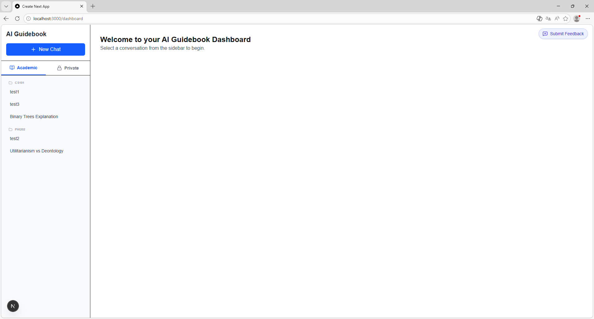 |
| TC-01-2 | REQ-01 | Verify conversations are categorized into Academic and Private | 1. Open the dashboard. 2. Inspect the sidebar conversation area. | The sidebar shows separate Academic and Private conversation categories. | As expected | Pass |  |
| TC-01-3 | REQ-01 | Verify a conversation opens as a discussion window | 1. Open an existing conversation from the sidebar. | The selected conversation opens in a chat/discussion-style interface. | As expected | Pass | 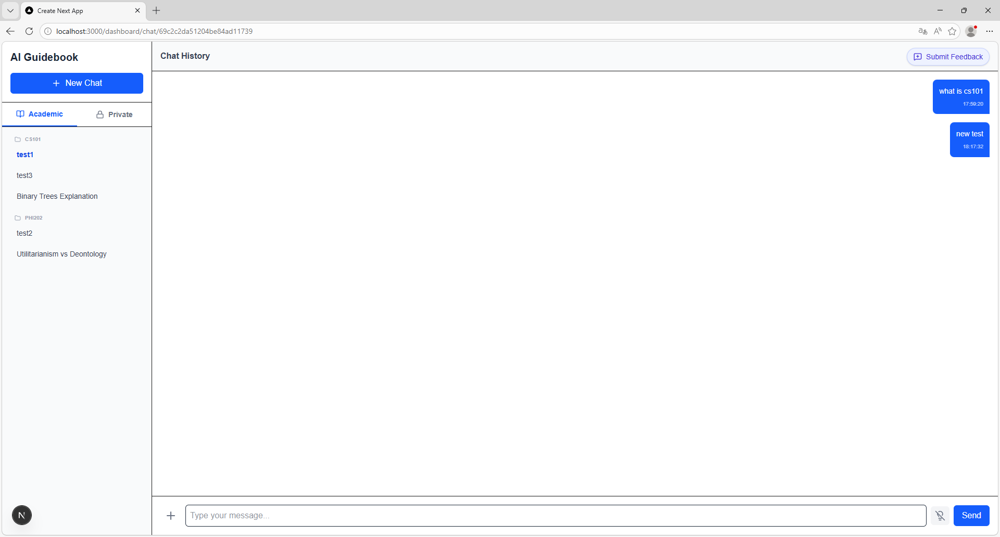 |
| TC-01-4 | REQ-01 | Verify academic conversations are grouped by course and arranged chronologically	| 1. Reload the dashboard. 2. Review academic conversation groups and ordering. | Academic conversations are grouped by course and ordered by most recent activity. | As expected | Pass |  |
| TC-02-1 | REQ-03 | Verify that course materials can be uploaded into the sandbox | 1. Open a conversation. 2. Click the upload button, select "Confirm & Upload". 3. Select a course material file. 4. Confirm the upload. | The system allows the user to upload course material after confirmation. | As expected | Pass | 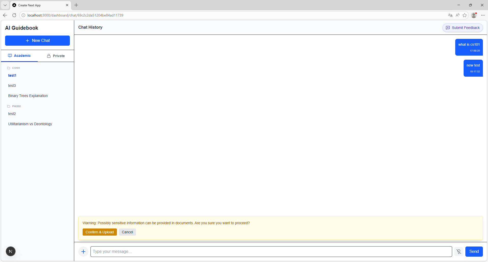 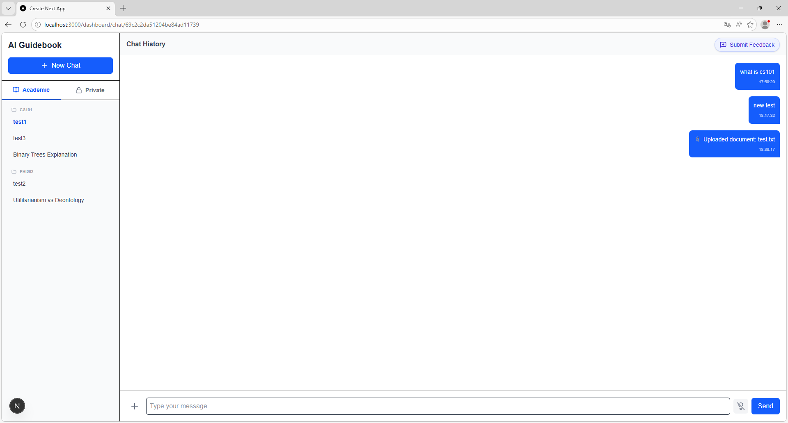 |
| TC-02-2 | REQ-03 | Verify that the AI answers based on uploaded material and provides verifiable citations | 1. Upload a document with identifiable content. 2. Ask a question based on that document. 3. Inspect the response. | The AI answers using the uploaded material and includes verifiable citations from it. | No actual AI-generated answer provided during testing. | Fail | [File](task3.3/2.2.txt) 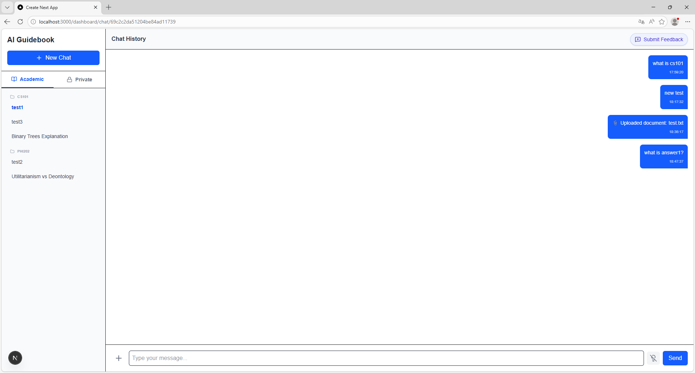 |
| TC-03 | REQ-04 | Verify that brainstorming mode logs the user prompt and generated idea, and that the log is accessible via a button in the conversation interface | 1. Open a conversation. 2. Enable brainstorming mode. 3. Enter a prompt and send it. 4. Check whether the generated idea is logged. 5. Verify that the brainstorming log can be accessed again. | When brainstorming mode is enabled, the system logs both the user prompt and the generated idea, and the log is accessible through a button in the conversation interface. | As expected | Pass | 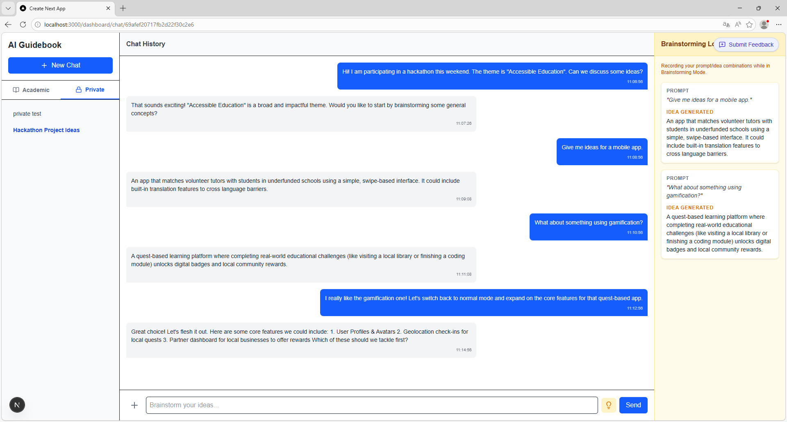 |
| TC-04 | REQ-22 | Verify that every AI response includes an easily accessible "Report Bias" option for flagging discriminatory content | 1. Open a conversation containing AI responses. 2. Move the mouse over an AI response. 3. Click the Report Bias button. 4. Click "Confirm Report" to submit the report. | The user can access the Report Bias option on an AI response and successfully submit a bias report after confirmation. | As expected | Pass | 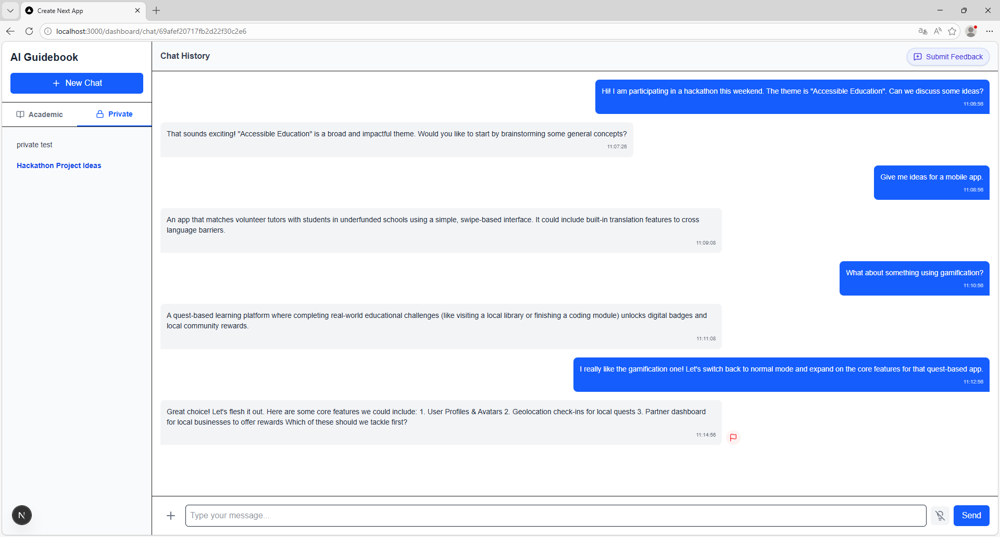 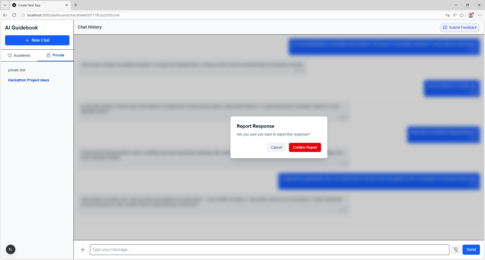  |
| TC-05 | REQ-29 | Verify that the system warns the user when personal contact details are entered in a message | 1. Open a conversation. 2. Type a name, address, phone number, and email address into the message input field in separate tests. 3. Attempt to send each message. | The system warns the user or blocks the message when personal contact details are detected. | No warning was shown for a name or address. A warning was shown for format like test@test.com and +4712345678, and the user had to confirm before sending. | Partial | 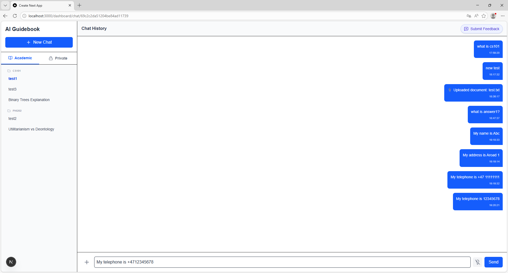  |
| TC-06 | REQ-30 | Verify that the system provides a contextual consent pop-up when uploading academic records | 1. Open a conversation. 2. Click the general upload button. 3. Select a file representing an academic record, such as a transcript. 4. Observe the system response before upload. | The system provides a contextual consent pop-up specifically related to uploading academic records, allowing the user to explicitly grant permission for that functionality. | The interface only provided a general document upload button, no dedicated notification was observed. | Fail |  |
| TC-07 | REQ-36 | Verify that the application allows students to submit feedback and satisfaction ratings directly within the system | 1. Open the feedback window. 2. Select a rating. 3. Enter written feedback. 4. Submit the form. | The application provides an in-app interface for submitting satisfaction ratings and written feedback. | As expected | Pass | 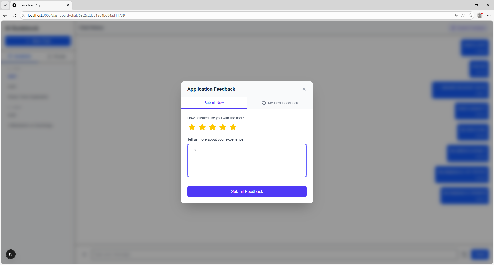 |
| TC-08 | REQ-32 | Verify that feedback submitted through the in-app feedback window is anonymised | 1. Open the feedback window in the application. 2. Enter a rating and written feedback. 3. Submit the feedback. 4. Check whether the system displays or stores any visible personal identity information together with the submission. | The submitted feedback is anonymised and does not expose the student’s identity in the visible interface. | History feedbacks can be found in "My Past Feedback", but no clear sign indicates that feedbacks are really anonymised. | Partial | 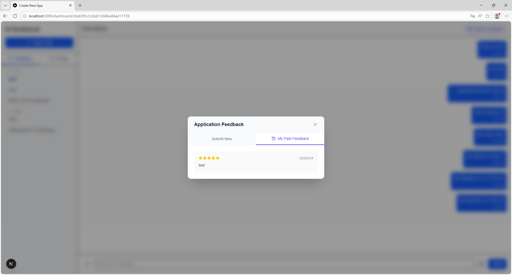 |

## Feedback

*Not yet graded.*
